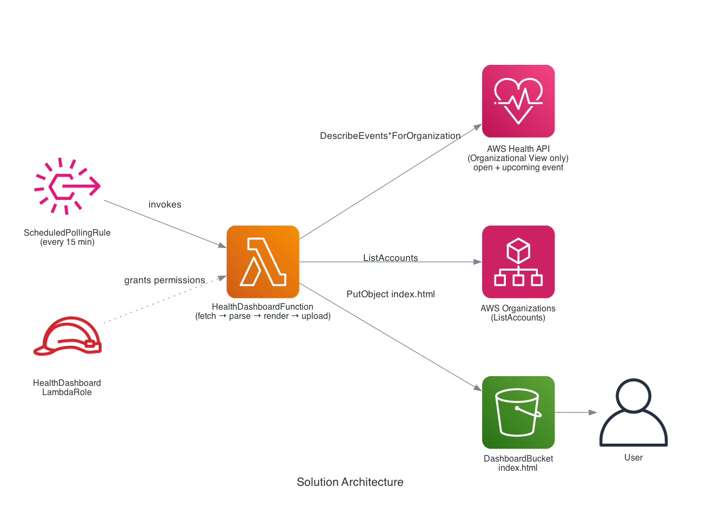

# AWS Health Dashboard

A minimal, serverless dashboard that polls AWS Health (Organizational View) on a
schedule and publishes a static, server-rendered `index.html` to a private S3
bucket.

## How it works

```
EventBridge
        │
        ▼
  Lambda: HealthDashboardFunction (HealthDashboard.py)
        │
        ├─ 1. Fetch: AWS Health Organizational View API (org-wide, no
        │    single-account fallback) + AWS Organizations (ListAccounts)
        │    Filters to "open" and "upcoming" events only — closed events
        │    are excluded at the query level.
        │
        ├─ 2. Parse: sorts events, computes KPI summary (open issues,
        │    upcoming changes, affected accounts/resources)
        │
        └─ 3. Render + Upload: builds a self-contained index.html
             (dark-themed dashboard, no external CSS/JS/CDN dependencies)
             and uploads it to the private S3 bucket
```

## Architecture




## Deployed AWS resources

This dashboard runs entirely on:

- **Lambda**: `HealthDashboard-Refresh` (Python 3.12, handler `index.lambda_handler`, 300s timeout, 256MB)
- **S3 bucket**: `aws-health-dashboard-<account-id>` 
- **EventBridge rule**: `HealthDashboard-ScheduledPoll`, invokes the Lambda
- **IAM role**: `HealthDashboardLambdaRole` — scoped to:
  - `health:DescribeEventsForOrganization`, `DescribeEventDetailsForOrganization`, `DescribeAffectedAccountsForOrganization`, `DescribeAffectedEntitiesForOrganization`, `DescribeEntityAggregatesForOrganization`, `DescribeHealthServiceStatusForOrganization`
  - `organizations:ListAccounts`, `DescribeOrganization`, `DescribeAccount`
  - `s3:PutObject` on the dashboard bucket only

### Environment variables (set on the Lambda)

| Variable | Value | Purpose |
|---|---|---|
| `DASHBOARD_BUCKET` | `<bucket name>` | S3 bucket the rendered `index.html` is uploaded to |
| `HEALTH_API_REGION` | `us-east-1` | AWS Health Organizational View is only available via `us-east-1` |


## Prerequisites

- The Health Organizational View must be enabled for your AWS Organization
  (`EnableHealthServiceAccessForOrganization`, run once from the management account).
- AWS CLI configured with credentials that can manage Lambda, IAM, EventBridge, and S3 in the target account.